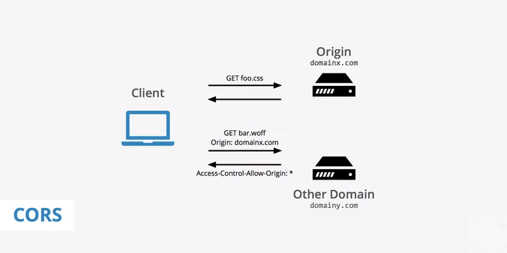

Ah yes, here the most interesting topic of the web  **Cross-origin resource sharing(CORS)** will be discussed and how we can handle CORS policies in cloud-rover will be discussed. 

## So What is CORS?
From Wikipedia
> Cross-origin resource sharing is a mechanism to safely bypass the same-origin policy; that is, it allows a web page to access restricted resources from a server on a domain different than the domain that served the web page. A web page may freely embed cross-origin images, stylesheets, scripts, iframes, and videos.



*Image Source:* [https://www.keycdn.com/support/cors](https://www.keycdn.com/support/cors)

## Handling CORS
As of right now we kept the thing as simple as possible. All you need is just a list of allowed origins that you want to allow like this
```ts
const corsWhiteList = ['http://localhost:6969', 'http://192.168.0.113:6969', 'http://192.168.10.109:6969'];
```

after that pass it to the `Rover()` middleware as the 5th parameter

Here's a full snippet
```ts

import { Rover } from 'cloud-rover';
import { router } from './router';

const corsWhiteList = ['http://localhost:6969', 'http://192.168.0.113:6969', 'http://192.168.10.109:6969'];

export default {
	async fetch(request, env, ctx): Promise<Response> {
        // highlight-next-line
		return Rover(request, router, env, ctx, corsWhiteList);
	},
} satisfies ExportedHandler<Env>;
```

## Allowing all origins
If you're unsure or testing on development you can use wildcard `*` for allowing all origins by simply passing `*` as the 5th parameter like this

```ts
return Rover(request, router, env, ctx, corsWhiteList);
```
:::warning
Allowing all origins is a bad security practice. Never allow all origins in a production build.
:::

If you need more control you have to build CORS header separately. As of right now Rover doesn't support a custom middleware so each route will must need to return CORS headers separately. 